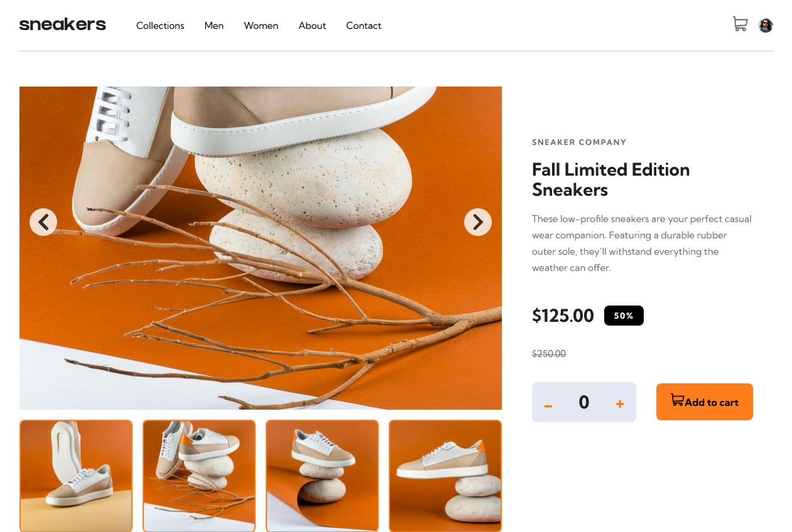

# Frontend Mentor - E-commerce product page solution

This is a solution to the [E-commerce product page challenge on Frontend Mentor](https://www.frontendmentor.io/challenges/ecommerce-product-page-UPsZ9MJp6). Frontend Mentor challenges help you improve your coding skills by building realistic projects.

## Table of contents

### The challenge

- View the optimal layout for the site depending on their device's screen size
- See hover states for all interactive elements on the page
- Open a lightbox gallery by clicking on the large product image
- Switch the large product image by clicking on the small thumbnail images
- Add items to the cart
- View the cart and remove items from it

### Screenshot

### Links

- Solution URL: [Add solution URL here](https://your-solution-url.com)
- Live Site URL: [Add live site URL here](https://your-live-site-url.com)

## My process

### Built with

- Semantic HTML5 markup
- CSS custom properties
- Flexbox
- CSS Grid
- Mobile-first workflow
- [React](https://reactjs.org/) - JS library
  -Vite
- SCSS

### What I learned

Continue my learning journey using state in React and passing props. In this case, I overcomplicated things because I used different components for the navigation, images, and second section, which made it difficult to pass props from the “add items” section to the navigation cart. I overthought that part too much.

I found useful resources on how to solve the problem, including the React documentation and some videos explaining how props work when passing data between different components.

### Useful resources

React Documentation.
Different React Couses scrimba, Traversy, general videos passing props.

### AI Collaboration

I used ChatGPT and Copilot when I got stuck on some small or confusing issues. My code became too messy at times, and it was hard to see the closing tags and structure clearly, so I used some help to organize the markup and make the code cleaner and easier to understand.

## Author

Catalina G.
